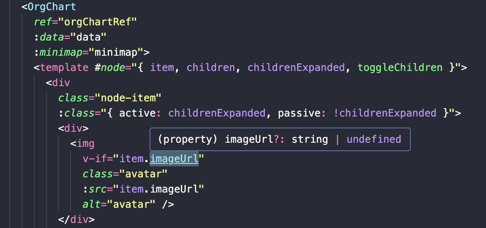

# Vue3 Org Chart

Forked from [n1crack/vue3-org-chart](https://github.com/n1crack/vue3-org-chart). Please refer to its README for original usage.

## Breaking Changes

- The OrgChart component is now a generic component. It now infers the type of data, which determines the type of `item` prop of the `node` slot. So you don't need to type cast `item` from `any` to the type of data you are passing to the component now.

  

- The component no longer returns an `api` object through the `on-ready` event. It now directly expose the following methods: `resetZoom`, `zoomIn`, `zoomOut`, `expandAll`, and `collapseAll`. The original `minimap.toggle` method is removed. You can just manipulate the value of minimap you pass to the component to toggle the minimap.

- You can no longer use `app.use()` to globally register the component because it's now a generic component. Just import the component and use it directly. Don't forget to import the stylesheet.

- The `json` prop is deprecated. Please fetch the data first, type it, and then pass it to the component.
